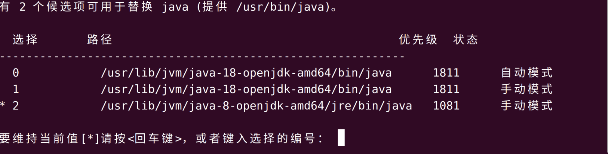

# SPECjvm2008

--------------------------

## 安装

按照user guide安装即可

我的舍友都说下载很慢

但是我没有这个问题

那是因为我之前花了很多功夫去给虚拟机配clash

**🤭**

**非常好clash for Linux，加速安装包下载，爱来自Windows上的Ubuntu虚拟机**

([GitHub - Fndroid/clash_for_windows_pkg: A Windows/macOS GUI based on Clash](https://github.com/Fndroid/clash_for_windows_pkg))

----------------------

## 测试

**首先安装JDK8**

> sudo apt install openjdk-8-jdk

**修改Linux环境变量**

> sudo update-alternatives --config java
> 
> 此时出现三条信息，前两条是之前安装的JDK18的
> 
> 最后一条是刚刚安装的JDK8的
> 
> 有 2 个候选项可用于替换 java (提供 /usr/bin/java)。

> 选择 **2**，然后回车
> 
> 在终端中输入
> 
> nano ~/.bashrc
> 
> 在文件末尾添加
> 
> export JAVA_HOME=/usr/lib/jvm/java-8-openjdk-amd64  
> 
> 保存并离开
> 
> source ~/.bashrc #使环境变量更改生效
> 
> 运行以下命令来验证Java版本和JAVA_HOME变量是否已正确设置
> 
> echo $JAVA_HOME
> java -version
> 
> 发现已正确设置

在目录下运行如下命令

> java  -jar SPECjvm2008.jar --base

但是发现程序一直卡在一个sunflow的地方

上网查了一下据说是因为有些进程死锁的原因

[卡在sunflow的解决办法]([华为云论坛_云计算论坛_开发者论坛_技术论坛-华为云](https://bbs.huaweicloud.com/forum/thread-174642-1-1.html))

按照网页上教的解决即可

但是在解决过程中又出现了新的问题，解决过程中第三步要求重新编译SPECjvm2008

> bash ./build-specjvm.sh

但是报错说找不到` JAVA_HOME`，找了一下

在`~/.bashrc`的末尾再加一行

> export PATH=/usr/lib/jvm/java-8-openjdk-amd64/bin:$PATH
> 
> 然后再
> 
> source ~/.bashrc

这次就解决了

在程序运行中某个测试爆了很多警告还是提示来着，但是对程序运行不影响，不用管

在大概一个多小时后程序运行完毕

-----------------------------------------

## 比较

[比较对象](https://www.spec.org/jvm2008/results/res2015q3/jvm2008-20150823-00019.base/SPECjvm2008.base.html) **Sugon Sugon I840-G25(Intel Xeon E7-4830 v2)**

选择比较compiler这一分数

官方的分数是**2546 ops/m**

而我的分数是**282 ops/m**

是九倍的差距，/(ㄒoㄒ)/~~

我认为的主要原因是

官方的那个数据使用的cpu有**40个核心**，一级和二级缓存比我的cpu要差很多，但是**三级缓存**却又比我的要高，内存更是高达**256GB**

而我的测试中，虚拟机能调用的只是**2个核心**，**4GB的内存**，虽然我的芯片是21年生产的，比官方拿来测试的要早6年（2015年产），但是这点差距不是力大砖飞可以弥补的

😢

---------------------

## 感想和体会

**非常坏官方文档，全部英文，恨来自英语坏的人了😡**

**也许数据学子该学点计组？🤔**

