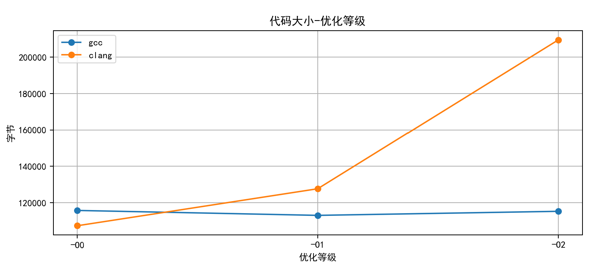
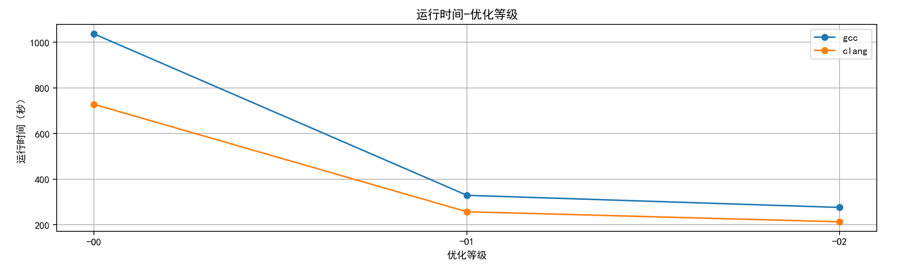

# A3

-----------------

**gcc和clang安装，略**

------------------

## Write-up 1

--------------------

`clang` 用于编译C语言代码，而 `clang++` 用于编译C++代码，但它们都使用 LLVM 编译器基础架构，两个命令都调用了相同的 LLVM/Clang编译器，所以两个命令的输出结果是一样的。

----------------------------

## Write-up 2

---------------------

选择的是`loop_fusion.cpp`这一测试用例

选择理由：该程序会测试与合并循环相关的编译器优化，也称为循环融合、循环组合、循环压缩。以前写出过四五个嵌套循环的。

------------------------------------

## Write-up 3

-----------------------------------------

我使用的性能测试集是从pdf中给出的网址那直接clone下来的，因此工作流程与pdf中讲述不太一样

在一次工作流程的循环中，以gcc -o0为例

----------------------

#### 1.

在目录中`make clean`

#### 2.

`nano makefile`

```
# GCC 8
#CC = gcc
#CXX = g++


# Clang/LLVM 8
#CC = clang
#CXX = clang++
```

把选择的编译器的对应两行取消注释

```
CFLAGS = $(INCLUDE) -O0
CPPFLAGS = -std=c++14 $(INCLUDE) -O0
```

更改为对应的优化等级

```
REPORT_FILE = report-gcc-O0.txt
```

重新命名输出的文件

对`BINARIES`和`report:  $(BINARIES)`的修改略

#### 3.

`make all`

#### 4.

`make report`

--------------------------

进行这样的循环6次，完成测试

对源文件没有修改，因为`-O0`的可执行文件需要执行大约十几分钟左右，`-O1`的可执行文件需要执行大约四五分钟左右，我认为这样的运行时间是充分的。

---------------------------------

## Write-up 4

-------------------------------------

#### 代码大小对比



对于**gcc编译器**来说，`-O1`的优化级别的代码是最小的，另外两种优化级别的大小则差不多，下面是具体数值

```
gcc -o0 115728 10月 30 05:07 loop_fusion
gcc -o1 113024 10月 30 05:41 loop_fusion
gcc -o2 115256 10月 30 05:52 loop_fusion
```

而对于**clang编译器**来说，`-O0`的优化级别的代码反而是最小的，往后代码大小反而增大了，尤其是从`-O1`到`-O2`，代码的大小增加了**75%**。

一般我会认为随着优化等级的提高，生成的代码大小也会下降，但是clang编译器的图像改变了我的这种想法，我猜测这**可能是因为Clang编译器在更高的优化级别下生成了更多的代码，应用了更多的优化技术以提高性能，而从下面代码运行性能的对比中来看，虽然代码大小更大，但是代码的运行时间是更短的**。

-------------------------------

#### 代码运行性能对比



对于**gcc编译器和clang编译器**来说，运行时间都随着优化等级的提升而逐步下降，而在纵向上对比，明显**clang编译器**编译出的代码运行时间都短于**gcc编译器**。

我认为，运行时间都随着优化等级的提升而逐步下降，是非常正常且合理的现象，而对于gcc和clang的差距，我倾向于认为这是这是两种编译器的不同导致的。
