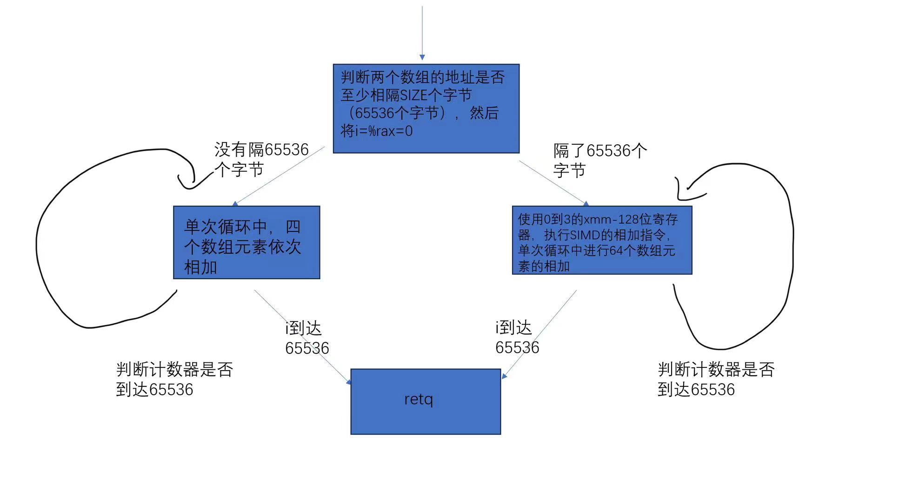

# README

------------

## 1

-------------------



在进行完初始的判断之后，自己生成的汇编代码会将rax设置为0，等同于i的值，看地址偏移量部分的汇编代码更直观。而题目给出的代码会将rax的值设为-65536，在数组的地址计算中用到了该值，导致计算地址部分的代码不是很直观。

在自己生成的代码中，xmm寄存器使用了0-3，在题目的代码中使用了0-4。


自己生成的代码使用寄存器更少，硬件资源消耗更少，而且可读性更高，计算地址偏移时计算量更少（偏移量为0时，只用两个相加，题目给出的要三个数相加）

题目给的汇编代码没看出什么优点


clang版本为`Ubuntu clang version 14.0.0-1ubuntu1.1`

--------------------

## 2

----------------

区别在于：

1生成的汇编代码中，进行一个判断，判断后可能进入一个一次处理4个数组元素加的循环，也有可能进入一次处理64个数组元素加的循环

2中直接就进入了一次处理64个数组元素加的循环，而且也没有了前面的判断。


原因在于：

`restrict` 关键字是 C 语言的一种关键字，用于告诉编译器，表示函数 `test` 的两个指针参数 `a` 和 `b` 分别指向不同的内存区域，没有重叠。这样的声明允许编译器在优化代码时更好地进行一些假设，有助于生成更有效的代码。

1的代码没有这个关键字，编译器需要更保守的优化，以避免可能的错误。

-----------------------------

## 3

-------------------------

区别在于：

2中的代码使用的SIMD指令是`movdqu`指令，表示不需要对数据进行对齐操作

3中的代码使用的SIMD指令是`movdqa`指令，表示对数据进行了对齐操作。在很多架构上，对齐的数据访问通常更加高效


通过

```
a = __builtin_assume_aligned(a, 16);
b = __builtin_assume_aligned(b, 16);
```

编译器知道这两个数组是按照16字节对齐的，这样编译器就可以生成更有效率的代码

--------------------------

## 4

---------------------------

4产生的汇编代码使用了AVX2指令集，而3使用的是SSE指令集

在编译命令中添加了AVX2=1这一选项，选择启用 AVX2 指令集，因此产生了这一差别

修改后的代码

```c
#include <stdint.h>
#include <stdlib.h>
#include <immintrin.h>  // 包含 AVX2 头文件

#define SIZE (1L << 16)

void test(uint8_t * restrict a, uint8_t * restrict b) {
  uint64_t i;

  // 使用 _mm256_load_si256 函数进行对齐加载
  __m256i* avx_a = (__m256i*)a;
  __m256i* avx_b = (__m256i*)b;

  for (i = 0; i < SIZE / 32; i++) {
    // 使用 AVX2 指令进行矢量化的字节相加
    __m256i avx_result = _mm256_add_epi8(_mm256_load_si256(a>
    // 使用 _mm256_store_si256 函数进行对齐存储
    _mm256_store_si256(avx_a + i, avx_result);
  }
}
```

--------------------------------------

## 5

---------------

更改后的编译代码明显更短，汇编代码的主体部分有30行左右，而更改前的汇编代码的主体部分有200行左右，差距十分明显，而且更改后的编译代码，使用了pmaxub这一指令，这是在更改前的汇编代码中所没有见到的


造成这样的原因可能是，在某些情况下，编译器会更容易将三元运算符形式的 `max` 操作进行向量化，因为这种形式更类似于数学运算的表示，而向量化通常是基于数学表达式的，而`if` 语句的控制流结构会导致一些额外的分支和条件判断

-----------------------------

## 6

--------------------------

在汇编代码中的基本流程是这样的

1. 将寄存器 %rax 的值压栈，并设置栈帧偏移

2. %rdi为a的起始地址，%rsi为b的起始地址

3. 将%rsi的值加一

4. 调用 `memcpy` 函数，从%rsi所指向的地址开始，拷贝 65536 字节的数据到%rdi所指向的地址

5. 将%rax寄存器的值弹出栈，并返回


可能是因为这个循环较为简单，只是简单的遍历b的元素并赋值给a的元素，向量化之后反而可能引入额外的开销且没有带来明显的性能提升


我认为编译器对这个循环进行向量化不能生成更高性能的代码，因为原有的汇编代码足够简洁直接了，通过一次性调用一个memcpy函数取代了一个65536次的循环。

-----------------------

## 7

-----------------------------

在第一次生成的代码中，循环没有被展开，而是使用了简单的逐个元素相加的方式。每次循环迭代，都会处理数组中的一个元素，然后将结果累加到xmm0 中

在第二次生成的代码中，循环被展开了，使用了 SIMD 指令执行向量化操作，每次迭代处理了两个元素。这样的展开可以提高计算密集型循环的性能，减少了循环迭代的开销


这是因为-ffast-math选项会被启用于一些可能会改变数学运算行为的优化，以提高代码的执行速度，这个选项会允许编译器执行一些不严格遵循 IEEE 浮点数规范的优化，以牺牲一些精度来换取性能提升

-----------------------------------

## 8

----------------------------------------------

| ms(毫秒) | real | user | sys |
| ------ | ---- | ---- | --- |
| make   | 61   | 61   | 0   |
| V=1    | 16   | 16   | 0   |
| V=A=1  | 9    | 4    | 0   |


实验平台：Azure的提供的远程云主机，Ubuntu系统，x86系统，单核单线程，芯片为

Intel(R) Xeon(R) Platinum 8171M CPU@ 2.60GHz


明显地，随着优化选项的增加，程序用时基本都在减少


这种性能提升的原因主要归功于我们充分利用了Intel处理器的SIMD指令集，使得处理器能够同时处理多个数据元素，而不是逐个处理。在启用向量化编译选项时，编译器能够生成能够充分利用硬件并行性的代码，从而减少了循环迭代的开销。

进一步启用AVX2指令集，则在矢量寄存器宽度上进行了扩展，使得每个矢量寄存器能够容纳更多的数据，进一步提高了并行计算的效率。

实验平台采用了Intel处理器，该处理器对包括AVX2指令在内的SIMD指令集提供了强大的支持，因此才有很好的性能提升。
