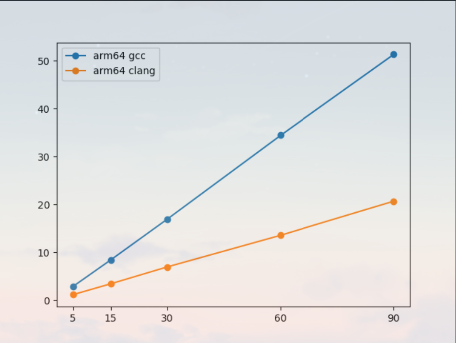
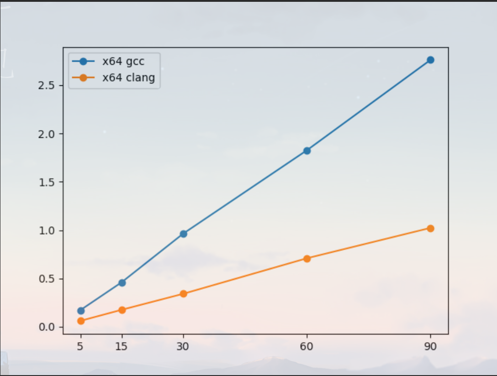

# README

# P2

--------------------

## 1和2

------------------------------

安装Qemu的方法参考csdn上的一个文章，原文连接在下

[ubuntu虚拟机中使用QEMU搭建ARM64环境_qemu-aarch64-static-CSDN博客](https://blog.csdn.net/qq_41660119/article/details/123949923)

这里仅给出使用的命令行，首先下载和安装qemu-system-aarch64和gcc-10-aarch64-linux-gnu，下载gcc-10-aarch64-linux-gnu，记得将其设置为aarch64-linux-gnu-gcc，安装过程中如果要求重启一些服务，选择全部并重启这些服务。

```bash
$ sudo apt install qemu-system-aarch64
$ qemu-system-aarch64 --version
------------------------------
QEMU emulator version 6.2.0 (Debian 1:6.2+dfsg-2ubuntu6.15)
Copyright (c) 2003-2021 Fabrice Bellard and the QEMU Project developers
------------------------------
$ sudo apt install gcc-10-aarch64-linux-gnu
$ aarch64-linux-gnu-gcc-10 --version
$ cd /usr/bin
$ sudo ln -s aarch64-linux-gnu-gcc-10 aarch64-linux-gnu-gcc 
# 将其设置为aarch64-linux-gnu-gcc
--------------------------------
aarch64-linux-gnu-gcc-10 (Ubuntu 10.5.0-1ubuntu1~22.04) 10.5.0
Copyright (C) 2020 Free Software Foundation, Inc.
This is free software; see the source for copying conditions.  There is NO
warranty; not even for MERCHANTABILITY or FITNESS FOR A PARTICULAR PURPOSE.
-------------------------------
$ sudo apt-get install debian-archive-keyring bison flex bc build-essential libncurses* libssl-dev
$ sudo apt-get install  qemu-user-static binfmt-support debootstra
# 创建一个工作目录test
$ mkdir test
$ cd test
$ sudo su
$ debootstrap --arch=arm64 --foreign buster linux_rootfs http://mirrors.ustc.edu.cn/debian/
$ sudo cp /usr/bin/qemu-aarch64-static ./linux_rootfs/usr/bin/
$ sudo chroot linux_rootfs/ debootstrap/debootstrap --second-stage
$ chroot linux_rootfs/
$ passwd root
# 设置root用户的密码
$ useradd -G sudo -m -s /bin/bash huangzihao
$ passwd huangzihao
# 设置自己的用户和密码
$ echo Arm64InUbuntu > /etc/hostname
# 设置主机名
$ echo "auto lo" > /etc/network/interfaces
$ echo "iface lo inet loopback" >> /etc/network/interfaces
$ echo "allow-hotplug enp0s1" > /etc/network/interfaces
$ echo "iface enp0s1 inet dhcp" >> /etc/network/interfaces
$ apt update
$ apt install net-tools
$ exit
---------------
$ cd ~/test # 回到工作目录
$ dd if=/dev/zero of=linux_rootfs.ext4 bs=1M count=2048
# 使用dd命令来创建一个image文件，bs=1M表示block大小，count=2048，
# 表示该image大小为2GB，读者可以根据主机磁盘空间，适当调整该大小，建议不小于2GB
# 我自己设置的是5GB
$ mkfs.ext4 linux_rootfs.ext4
$ mkdir -p tmpfs
$ sudo mount -t ext4 linux_rootfs.ext4 tmpfs/ -o loop
$ sudo cp -af linux_rootfs/* tmpfs/
$ sudo umount tmpfs
$ sudo chmod 777 linux_rootfs.ext4
$ wget https://mirrors.edge.kernel.org/pub/linux/kernel/v5.x/linux-5.15.tar.gz
$ tar -xzvf linux-5.15.tar.gz
$ cd linux-5.15
$ export ARCH=arm64
$ export CROSS_COMPILE=aarch64-linux-gnu-
$ make defconfig
$ make -j4 
# 用make -j带一个参数，可以把项目并行编译，比如在一台双核的机器上，
# 完全可以用make -j4，让make最多允许4个编译命令同时执行，
# 可以更有效利用CPU资源
--------------
$ cd ~/test # 回到工作目录
$ sudo qemu-system-aarch64 -m 1024 -cpu cortex-a57 -M virt -nographic -smp 4 -kernel linux-5.15/arch/arm64/boot/Image -append "noinintrd sched_debug root=/dev/vda rootfstype=ext4 rw crashkernel=256M loglevel=8" -drive if=none,file=linux_rootfs.ext4,id=hd0 -device virtio-blk-device,drive=hd0 
# 这个命令比较长
# -m 1024 指定内存大小为１G
# -cpu指定了模拟的cpu为 cortex-a57；
# -M machine选择模拟的机器；
# -nographic禁止所有的图形输出；
# -smp 4指定模拟的系统为４核处理器 ；
# -kernel指定启动的内核镜像；
# --append指定传递的命令行参数；
# 后面的“-drive if=none,file=myrootfs_arm64.ext4,id=hd0 -device virtio-blk-device,drive=hd0”添加根文件系统支持
# 该命令输出一长串之后来到下面的界面
----------------------
[   11.237964] virtio_net virtio1 enp0s1: renamed from eth0
[  OK  ] Started Update UTMP about System Runlevel Changes.

Debian GNU/Linux 10 arm64inUbuntu ttyAMA0

arm64inUbuntu login:
# 登录root账户，输入密码
----------------------
Debian GNU/Linux 10 arm64inUbuntu ttyAMA0

arm64inUbuntu login: root
Password:
Last login: Thu Nov 30 05:01:57 UTC 2023 on ttyAMA0
Linux arm64inUbuntu 5.15.0 #1 SMP PREEMPT Thu Nov 30 10:34:54 CST 2023 aarch64

The programs included with the Debian GNU/Linux system are free software;
the exact distribution terms for each program are described in the
individual files in /usr/share/doc/*/copyright.

Debian GNU/Linux comes with ABSOLUTELY NO WARRANTY, to the extent
permitted by applicable law.
root@arm64inUbuntu:~#
-----------------------
# 这样就进入了arm64虚拟机，可以使用ls，cd等等linux命令，
# apt install也可以用
# 在这个界面按住ctrl+A，再按X，就可以退出并关闭虚拟机
# 下面是如何向从宿主机Ubuntu_x86向虚拟机arm64中添加文件的示例
-----------------------
# 在宿主机中，进入工作目录
$ cd ~/test
$ cd linux_rootfs
$ sudo nano helloworld.c
# 没有nano的话就自行apt下载，在这里创建文件和添加文件本质是一样的
# 记得要使用sudo，在linux_rootfs下创建文件或将文件移到这里
# 创建helloworld.c的具体内容略
$ cd ~/test
$ sudo mount -t ext4 linux_rootfs.ext4 tmpfs/ -o loop
$ sudo cp -af linux_rootfs/* tmpfs/
$ sudo umount tmpfs
$ sudo chmod 777 linux_rootfs.ext4 
-------------------
# 进入虚拟机
$ sudo qemu-system-aarch64 -m 1024 -cpu cortex-a57 -M virt -nographic -smp 4 -kernel linux-5.15/arch/arm64/boot/Image -append "noinintrd sched_debug root=/dev/vda rootfstype=ext4 rw crashkernel=256M loglevel=8" -drive if=none,file=linux_rootfs.ext4,id=hd0 -device virtio-blk-device,drive=hd0 
# 下面是虚拟机arm64中的操作
--------------------
$ cd /
$ ls
# 可以看到有个helloworld.c，文件传入成功
```

## 3

----------------------

```bash
# 首先将两个文件传入工作目录,以下操作在工作目录中完成
$ cd ~/test
$ aarch64-linux-gnu-gcc -O2 -o loop.aarch64.gcc loop.c -static
# 将该文件复制进linux_rootfs目录中，并按上面提过的步骤操作，要使用sudo
# 进入虚拟机arm64，下面是在虚拟机中的操作
-----------------
$ cd /
$ ls
# 可以看到复制进去的loop.aarch64.gcc
$ ./loop.aarch64.gcc 1
# 下面是运行结果
Elapsed execution time: 0.561347 sec; N: 1024, I: 100000, __OP__: +, __TYPE__: uint32_t
# 程序运行成功
```

**编译命令中为什么要带-static这一选项？**

答：如果不带这一选项，传入的可执行文件执行时会出现如下报错

```bash
root@arm64inUbuntu:/# ./hello
./loop.aarch64.gcc: /lib/aarch64-linux-gnu/libc.so.6: version `GLIBC_2.34' not found (required by ./hello)
```

显示的是你在宿主机Ubuntu_x86编译时，编译的一个库文件glibc版本为2.34，而虚拟机arm64中glibc版本较低，所以在虚拟机中无法运行此可执行文件（运行命令` ldd --version `可以查看glibc的对应版本，我的宿主机中glibc的版本是2.35，而虚拟机中的版本是2.28），对于这个问题，我做了一些尝试去解决此问题。

1. glibc的版本跟安装虚拟机时选用的Linux内核源代码的版本有关系，因此在下载Linux内核源代码时选择跟宿主机一样的Linux内核源代码版本，`uname -r`可以查看Linux内核版本，在Linux内核代码下载网站[Index of /pub/linux/kernel/](https://mirrors.edge.kernel.org/pub/linux/kernel/)找到对应版本和下载链接并使用wget下载，然后按照之前的那样步骤编译安装一个虚拟机，这样虚拟机和宿主机的Linux内核版本就一样了。结果发现这样安装的宿主机和虚拟机的glibc版本还是不一样，也许可以尝试虚拟机的Linux内核版本比宿主机更高，但是我没有探究这样做。

2. 在第一步尝试之后，尝试修改虚拟机的glibc版本，在下载对应版本的glibc源代码，解压为glibc-2.34后，再在同一目录下创建一个build文件夹，在该目录下先进行一个`./configure`（他不推荐在源代码那个文件夹里进行此操作），然后该命令会输出一些检测环境的信息，检测gcc，python3等等软件啥的，如果虚拟机中没有这些软件就会显示error，先安装这些依赖，而上面那个命令通过后他也会显示一个警告，建议你不要将 `glibc` 安装到 `/usr/local` 目录下，因为这可能导致系统无法正常使用，我决定无视此警告，并再次`./configure --disable-sanity-checks`(这个命令可以忽略此警告)，然后`make`，但是这个make的时间太长了，长到我已经需要盖上笔记本去上课了，盖上笔记本去上课之后，Windows终端与云主机的链接就会断联，然后这个进程就会取消，遂放弃。

3. 在编译时使用静态链接，将 glibc 库嵌入到可执行文件中。这样，可执行文件就不再依赖于系统上的共享库。静态链接可能导致可执行文件变得较大，但是我认为这已经是所有方法中最简单直接的了。

-----------------------------

## 4

---------------------------------

```bash
$ clang --target=aarch64-linux-gnu -O2 -o loop.aarch64.clang loop.c -static
--------------
# in arm64
$ ./loop.aarch64.clang 1
Elapsed execution time: 0.235849 sec; N: 1024, I: 100000, __OP__: +, __TYPE__: uint32_t
```

-------------------------

## 5

------------------------------



```txt
arm64 gcc
5    2.832098
15    8.384091
30    16.928560
60    34.426841
90    51.315861
arm64 clang
5     1.135304
15     3.407558
30     6.942604
60     13.550609
90    20.661655
```

-----------------------------

## 6

----------------------------

```bash
$ clang -O2 -o loop.x64.clang loop.c -static
$ gcc -O2 -o loop.x64.gcc loop.c -static
```



```txt
x64 gcc
5    0.171120
15    0.458933
30    0.964331
60    1.826440
90    2.761800
x64 clang
5    0.060676
15    0.175048
30    0.341404
60    0.708996
90    1.023445
```

---------------------------

## 7

---------------------------

```bash
$ apt-get install gdb-multiarch
$ gdb-multiarch --version
GNU gdb (Debian 8.2.1-2+b3) 8.2.1
Copyright (C) 2018 Free Software Foundation, Inc.
License GPLv3+: GNU GPL version 3 or later <http://gnu.org/licenses/gpl.html>
This is free software: you are free to change and redistribute it.
There is NO WARRANTY, to the extent permitted by law.
```

--------------------------

## 8

-------------------------------------

```bash
$ cd ~/test
$ aarch64-linux-gnu-gcc -g -O2 -o loop.aarch64.gcc.debug loop.c -static
--------------------------
# 下面是调试方法简介，启动 QEMU 时，
# 添加 -s -S 选项，使其等待 GDB 连接。
# 这样 QEMU 将在启动后暂停，并等待 GDB 连接
$ sudo qemu-system-aarch64 -m 1024 -cpu cortex-a57 -M virt -nographic -smp 4 -kernel linux-5.15/arch/arm64/boot/Image -append "noinintrd sched_debug root=/dev/vda rootfstype=ext4 rw crashkernel=256M loglevel=8" -drive if=none,file=linux_rootfs.ext4,id=hd0 -device virtio-blk-device,drive=hd0 -s -S
# 打开另一个终端窗口，同样是在test文件夹下
$ gdb-multiarch loop.aarch64.gcc.debug
# 然后使用 gdb-multiarch 连接到 QEMU
$ target remote localhost:1234
-----------------------------
ubuntu@10-9-24-70:~/try$ gdb-multiarch loop.aarch64.gcc.debug
GNU gdb (Ubuntu 12.1-0ubuntu1~22.04) 12.1
Copyright (C) 2022 Free Software Foundation, Inc.
License GPLv3+: GNU GPL version 3 or later <http://gnu.org/licenses/gpl.html>
This is free software: you are free to change and redistribute it.
There is NO WARRANTY, to the extent permitted by law.
Type "show copying" and "show warranty" for details.
This GDB was configured as "x86_64-linux-gnu".
Type "show configuration" for configuration details.
For bug reporting instructions, please see:
<https://www.gnu.org/software/gdb/bugs/>.
Find the GDB manual and other documentation resources online at:
    <http://www.gnu.org/software/gdb/documentation/>.

For help, type "help".
Type "apropos word" to search for commands related to "word"...
Reading symbols from loop.aarch64.gcc.debug...
(gdb) target remote localhost:1234
Remote debugging using localhost:1234
0x0000000040000000 in ?? ()
(gdb)
------------------------
# 这时就可以在gdb中调试了，第三个调试过程就不会了，因为我真的用不来这个
```

下面是test最终的工作目录的展示

```bash
ubuntu@10-9-24-70:~/try$ ls -al
total 2795504
drwxrwxr-x  5 ubuntu ubuntu       4096 Dec  1 00:34 .
drwxr-x---  7 ubuntu ubuntu       4096 Nov 30 14:31 ..
-rw-rw-r--  1 ubuntu ubuntu       3164 Nov 30 13:48 fasttime.h
drwxrwxr-x 24 root   root         4096 Nov 30 10:49 linux-5.15
-rw-r--r--  1 root   root    194969557 Nov  1  2021 linux-5.15.tar.gz
drwxr-xr-x 17 root   root         4096 Nov 30 14:31 linux_rootfs
-rwxrwxrwx  1 root   root   5368709120 Dec  1 00:21 linux_rootfs.ext4
-rwxrwxr-x  1 ubuntu ubuntu     649736 Nov 30 14:30 loop.aarch64.clang
-rwxrwxr-x  1 ubuntu ubuntu     645360 Nov 30 13:53 loop.aarch64.gcc
-rwxrwxr-x  1 ubuntu ubuntu     650816 Dec  1 00:22 loop.aarch64.gcc.debug
-rw-rw-r--  1 ubuntu ubuntu       3235 Nov 30 13:48 loop.c
-rwxrwxr-x  1 ubuntu ubuntu     908696 Dec  1 00:34 loop.x64.clang
-rwxrwxr-x  1 ubuntu ubuntu     900384 Dec  1 00:34 loop.x64.gcc
drwxr-xr-x  2 root   root         4096 Nov 30 10:26 tmpfs
```
